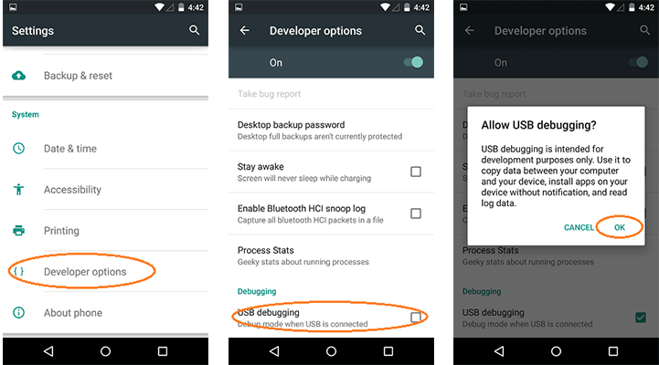
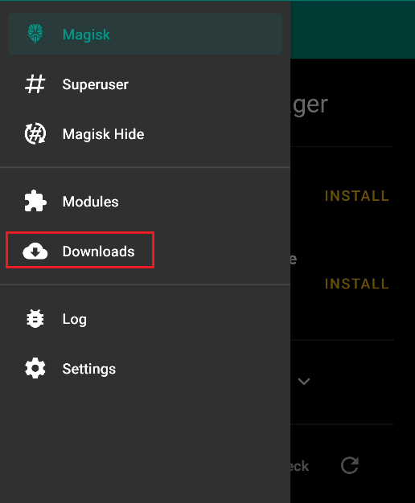
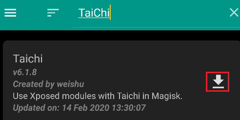
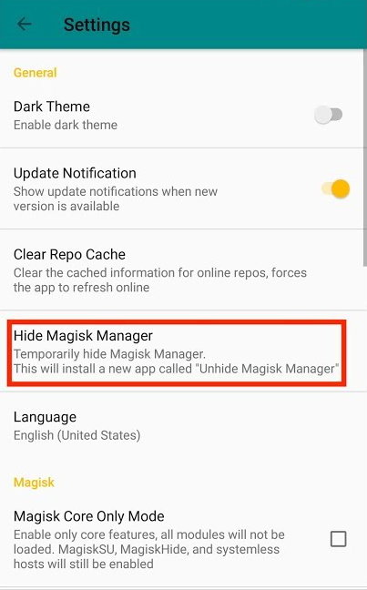
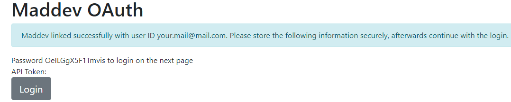
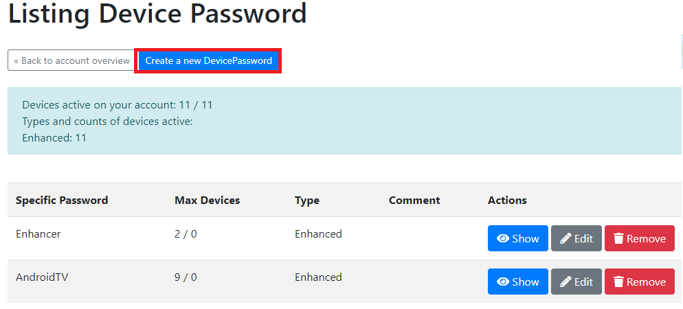
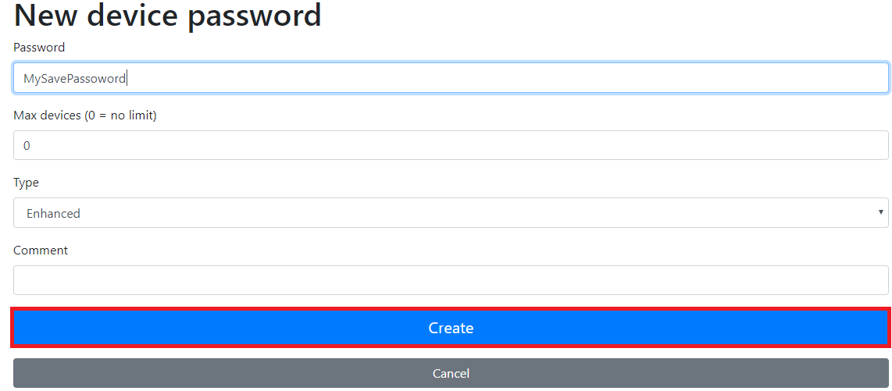
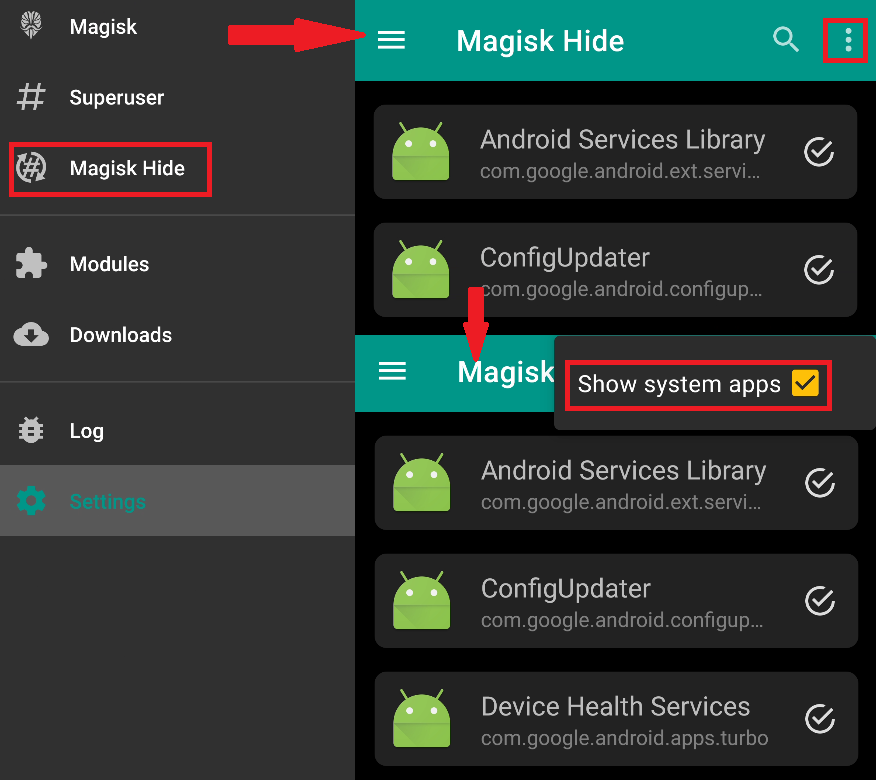

# Android Guide 5.2+ \(with Root\)

#### What you need to get started

* A rooted Android Phone on 5.2 or higher
* Read this :[ Cooldown, Strikes, Ban, Safety](../links-faqs-error/cooldown-strikes-ban-safety.md)

#### One of those Spoofing Apps :

* [GPS Joystick by Appninja](http://gpsjoystick.theappninjas.com/faq/)
* [GPS Spice Mod](https://drive.google.com/file/d/1DVyQkLqkd9Oe-mKRJvz7SDBaC-E6FRJI/view)
* [Pogo Enhancer\(Paid\)](https://maddev.eu/shop/)

### Can I root my Phone and is it safe?

If you can root depends on your Phone search for your model number on [TWRPs Website](https://twrp.me/Devices/), if you can't find your Phones model number you can't root.

Rooting in general is a safe process but on almost all phones you  lose your warranty if you do root.  
Before you root your phone find a written guide and follow that and _**always make a backup of your phone and download the stock firmware of your device for safety!**_

## **0. Install Magisk Root and Magisk Manager**

After you installed TWRP download the newest Version of [Magisk](https://github.com/topjohnwu/Magisk/releases) and the Manager.  
Copy both files to your Phone and reboot into Recovery Mode \(TWRP\).  
Click on the Install button and flash the Magisk.zip file you downloaded from above.  
Reboot the device, first reboot after Magisk has been flashed can take a couple of minutes so be patient.

## 1. Mock Location Fix



#### What you need to get started with Smali

* A Windows PC\(Or a Mac running Windows\)
* [Smali Patcher from XDA](https://forum.xda-developers.com/apps/magisk/module-smali-patcher-0-7-t3680053)

1. Enable [developer options](https://lmgtfy.com/?q=enable+developer+options+android&s=) 
2. Enable **USB debbuging**/**ADB Debugging**  \*\*\*\*
3. Open Smali Patcher with admin rights, and select only **Mock locations**. 
4. Click **ADB PATCH**\(The process will take some minutes. Be patient\).
5. After Smali Finished i should open the output folder where a new `.zip` file was created Copy that to your phone
6. Open Magisk/Modules and install that `.zip`. Restart the Phone



Please chek out the[ Video Guide from AroMods](https://www.youtube.com/watch?v=9pwFf2RKIVg)  


Taichi is a closed-source software framework!  
Be cautious!


#### What you need to get started with [TaiChi](https://taichi.cool/)

* [TaiChi apk](https://docs.google.com/uc?export=download&id=184UCF7ToZ1C3nTedORo71nX1mEDspJD4)
* [Mock Locations Module](https://dl-xda.xposed.info/modules/com.brandonnalls.mockmocklocations_v6_bfa37e.apk)

1. Open Magisk Manager  
2. Click on `Downloads`  
3. Search TaiChi and install the module   
4. Install TaiChi and Mock Location Module you downloaded above

more comming soon



-- Comming soon



## 2. Hide Root Access

1. Open Magisk Manager-&gt;Settings and enable Magisk Hide. Confirm the name and Magisk will hide itself\(takes a couple of seconds\). After its done Magisk will restart.  
2. Open the Magisk Hide option and select **Pokémon Go**  

## Install a Spoofing app



1. Download and install [GPS Spice Mod](https://drive.google.com/file/d/1DVyQkLqkd9Oe-mKRJvz7SDBaC-E6FRJI/view)
2. Go to **developer options** and set GPS Spice as mock location app
3. Go to **security settings** and disable device admins \(Turn off Find my Device\)
4. Open GPS Spice -&gt; settings and make shure that Indirect Mocking is disabled
5. 



1. Download [GPS Joystick by Appninja](http://gpsjoystick.theappninjas.com/faq/) \(Appstore App does not have privacy mode\)
2. Open it and enable privacy mode. It will promp you for a new name \(you set one\) and it will make a copy of the app with the name you took. Now delete original app.
3. Go to developer options, and set the renamed app as the mock locations app
4. Go to security settings and disable device admins \(Turn off Find my Device\)
5. Open the renamed app -&gt; settings and make shure that Indirect Mocking is disabled
6. For **Android 8.0.0 or below** change your GPS to device only  For **Android 9 or above** disable Wifi and Bluetooth scanning in the improve accuracy section in location settings



-- working on this guide!!!

1. Go to [maddev.eu](https://maddev.eu/shop/) an buy the Pogo Enhancer licence for 3,95$/month     - you can test PogoEnhancer for 24 hours without a payment
2. Download [PogoEnhancer](https://maddev.eu/apk/PogoEnhancer.apk) and Install it.
3. Open the [MadBackend](https://tinyurl.com/mad-reauth) and login with the password that is displayed on the site  
4. Login and Create a new Password    
5. Open PogoEnhancer on your android device and login with your Email and the password you created.
6. Change the settings to your liking \(it is recomended to change the injection delay from the default 120 seconds to 0-30 seconds depending on your device\)
7. Hit start and wait until the app as injected itself \(when the Nearby Radar shows you Pokemon\)

You can use this as a standalone app or use a spoofing app with this. It is important that you start your spoofing app **after** you started PogoEnhancer! This may change in the future as this app is still in development!  
  
You need to repeat step 2. everytime Pokemon Go updates.



##   

## Root - FAQ

### Pokemon still says 'Device is incompatible'?

Open your Magisk Manager and navigate to Magisk hide.  
Enable System Apps and hide `Google Play` Service and `Google Play Store`  

### How do i fix the CTSProfile?

Download [this module](https://docs.google.com/uc?export=download&id=1ngsqmKaAYJBaNHVjq8xunf2j-HDJAuDb) and install it in magisk.

  

