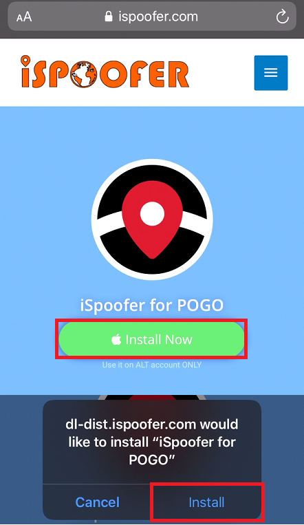
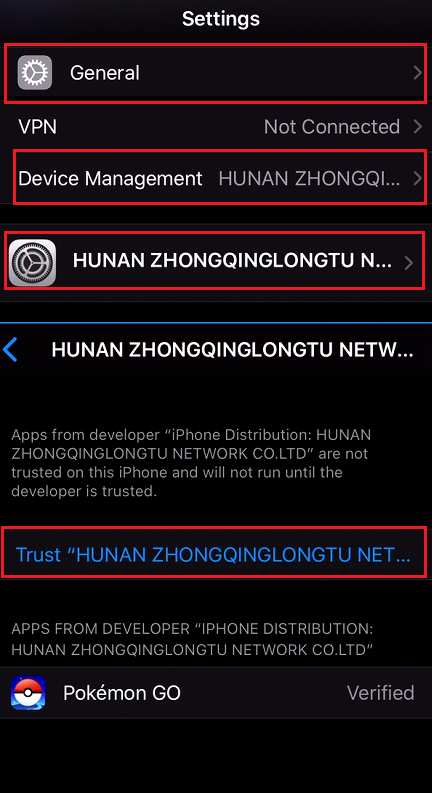
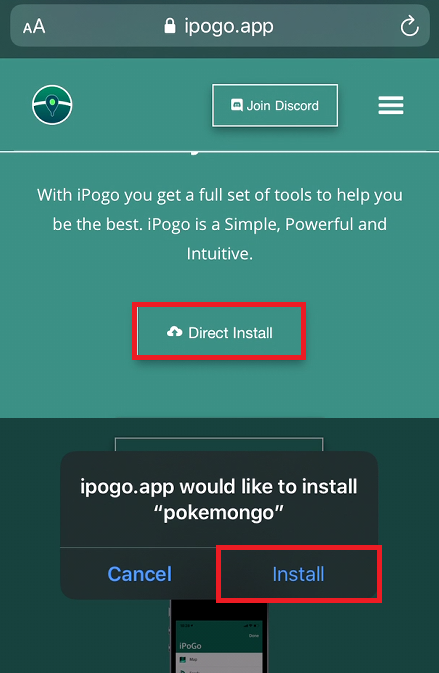

# Others



1. Open [iSpoofers Website](https://www.ispoofer.com/ispoofer-for-pogo-installation/) on your iDevice
2. Click on `Install Now` and then on `Install`   
3. After the app has been Installed open your Settings &gt; General &gt; Device Management and trust the developer  
4. iSpoofer requires a [Paid Subscription](https://www.ispoofer.com/#purchase) to have all features unlocked.



1. Open[ iPogos Website](https://ipogo.app/) on your iDevice
2. Click on `Direct Install` and then on `Install`   
3. After the app has been Installed open your Settings &gt; General &gt; Device Management  and trust the developer   4. Open the new Pogo app and login  This app is currently free \(16th of January 2020\) but once it is out of beta it will be paid subscription



coming soon - Saver  
  
in the meantime check out [Signulous](https://www.signulous.com/register) it is a IOS signing service  
  
IOS apps that have a Enterprise Certificate \(Direkt Download from iSpoofer,iPoGo etc.\) are **not** save to use!  
Self signed apps with a developer account or apps signed by another developer account are much saver! So try to use those services even if you need to pay an extra 10-20 $/Year



coming soon



coming soon



## No - Guide coming soon \*wink\*



